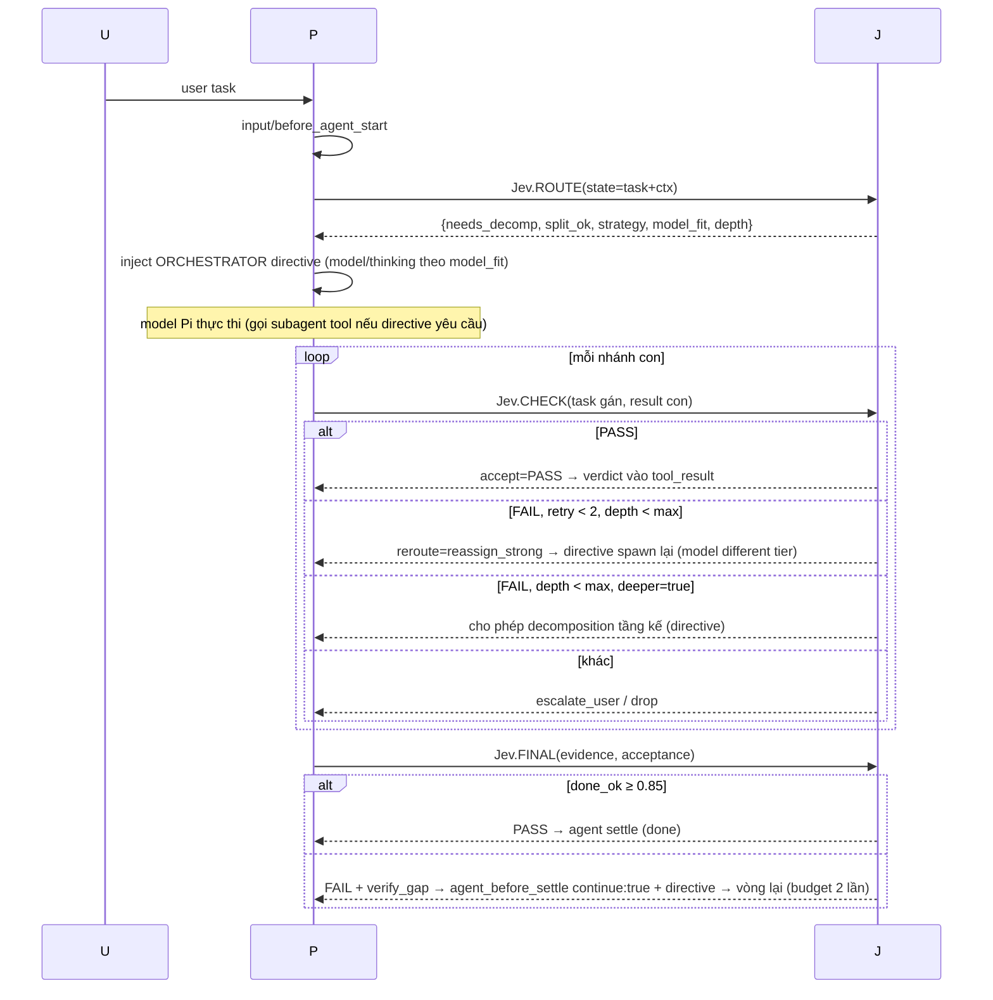

# Ý tưởng: `jev-orchestrator` — Jev là lớp điều phối động

> Trạng thái: **CHỈ Ý TƯỞNG — chưa code, chưa sửa gì.**
> Mục tiêu: 1 extension tại `C:\Users\Admin\.pi\agent\extensions\jev-orchestrator\index.ts` (tạo sau).
> Nguyên tắc sống: **Jev ra QUYẾT ĐỊNH (số typed), Pi (model) THỰC HIỆN.** Extension chỉ cầu nối: đưa state → Jev → nhận verdict → inject verdict vào đúng điểm của harness (theo audit `PI_HARNESS_ARCHITECTURE_VI.md` §22).

---

## 1. Tầm nhìn

Mọi task user đưa vào (không phân biệt lớn/nhỏ) đều đi qua Jev TRƯỚC: Jev quyết định cách xử lý — 1 agent, N agent song song, cây subagent nhiều tầng, hay giao trực tiếp. Khi mỗi agent/subagent hoàn thành, Jev kiểm tra (PASS/FAIL). FAIL → giao lại. Độ sâu hierarchy **không cố định** — Jev quyết theo từng nhánh, từng tầng.

```
User task
   │
   ▼
┌───────┐   route: direct | single | parallel-N | tree
│  Jev  │─────────────────────────────────────────────▶ Pi (main agent thực thi)
└───────┘
      ▲                mỗi nhánh hoàn thành:
      │                subagent result ──▶ Jev.check ──▶ PASS ──▶ merge/verify cha
      │                                   FAIL ──▶ retry_same | reassign | escalate | abort
      └──────── agent cha verify toàn bộ ──▶ Jev.final ──▶ PASS: done / FAIL: giao lại (vòng)
```

Phân biệt rõ 3 lớp (tránh trộn, đúng yêu cầu audit §6):
| Lớp | Ví dụ | Ai nắm |
|---|---|---|
| Model reasoning | suy luận, viết code, chọn tool | Pi (model) |
| Harness control flow | loop, context, retry, compaction | pi |
| **Orchestration decisions** | route/decompose/depth/verify/reassign | **Jev (typed numbers)** |

## 2. Reuse sẵn có (không tự viết)

| Thành phần | Dùng cái có sẵn | Không làm gì |
|---|---|---|
| Jev client (typed noul/choice/score) | `pi-typesafe` (package `~/.pi/agent/pi-typesafe`, cùng backend warden đang dùng: `judge.evaluate`, `TYPESAFE_API_KEY` / `/typesafe login`, backends typesafe/openrouter) | không viết HTTP client Jev mới |
| Runner subagent | `pi-subagents` (`subagent`, `subagent_supervisor`, `bg_wait`), `pi-herdsman` (agent definitions scout/researcher/implementer/reviewer + `chief`/`peer`), `@tintinweb/pi-tasks` (`TaskExecute` bg) | **không xây runner riêng** — extension chỉ quyết định, model gọi tool có sẵn để spawn |
| Guardrail (safety/secret/stuck/dedup/done-claim) | `pi-warden` giữ nguyên | không trùng: warden guard, orchestrator orchestrate (mục 7) |
| State persistence | session custom entries (`appendEntry`/`CustomEntry`, `customType:"jev_orch"`, không vào LLM context) | không file riêng |
| Inject quyết định | hooks audit §22: `before_agent_start` (directive message), `tool_result` (verdict vào kết quả subagent), `agent_before_settle` (FAIL → continue + entries) | không cần tool mới bắt buộc (mục 4) |

## 3. Các quyết định của Jev (typed questions)

Nguyên tắc TypeSafe: **1 factor 1 câu**, gộp 4–6 câu/request, threshold riêng. `state` = task text + acceptance criteria + transcript tail (trim `maxStateChars`).

### 3.1 ROUTE (tại `before_agent_start`, 1 lần/task)
| id | type | Câu (instructions) | Đọc | Threshold | Hành động |
|---|---|---|---|---|---|
| `needs_decomp` | noul | "Can this task NOT be completed by one agent in one pass?" | p | ≥0.7 → decompose | direct vs strategy |
| `split_ok` | noul | "Would independent parallel subtasks speed this up without contract risk?" | p | ≥0.7 → parallel | song song vs sequential |
| `strategy` | choice | "Which execution shape fits?" options: `single`, `parallel`, `tree`, `deep_sequential` | p | conf ≥0.6 | N agent & hình dạng |
| `model_fit` | choice | "Best model tier for the dominant work?" options: `fast`, `balanced`, `strong` | p | conf ≥0.5 | directive gợi ý model (pi.setModel nếu auth OK) |
| `depth` | score(0–4) | "Max useful decomposition depth?" levels 0..4 | p | round → maxDepth nhánh | chống vô hạn |

### 3.2 CHECK (mỗi subagent kết quả, tại `tool_result` filter toolName ∈ {subagent, agent, chief, peer, TaskGet/TaskExecute-bg})
| id | type | Câu | Đọc | Threshold | Hành động |
|---|---|---|---|---|---|
| `accept` | noul | "Does the evidence in this result satisfy the assigned acceptance criteria?" | p | ≥0.8 PASS | verdict append |
| `why_fail` | choice | "Why not?" options: `incomplete`, `wrong_approach`, `env_blocker`, `needs_user`, `false_fail` | p | conf ≥0.6 | chọn hướng reassign |
| `reroute` | choice | "Best next move?" options: `retry_same`, `reassign_strong`, `reassign_other`, `escalate_user`, `drop` | p | conf ≥0.7 | directive reassign (limit retry-per-branch = 2) |
| `deeper` | noul | "Is further decomposition of the remaining gap useful (depth < maxDepth)?" | p (đính depth hiện tại) | ≥0.7 | cho phép tầng kế |

### 3.3 FINAL (main agent, tại `agent_before_settle` boundary)
| id | type | Câu | Đọc | Threshold | Hành động |
|---|---|---|---|---|---|
| `done_ok` | noul | "Given the session evidence, does the task actually meet its acceptance criteria?" | p | ≥0.85 PASS | PASS → settle; FAIL → `continue:true` + context_edit/custom_message directive ("FAIL: missing evidence X — redo Y") + tự giảm budget |
| `scope` | noul | "Did the result exceed what the user asked?" | p | ≥0.75 → cảnh báo directive | anti over-engineering |
| `verify_gap` | choice | "Missing verification?" options: `none`, `tests`, `runtime`, `review`, `user_confirm` | p | conf ≥0.6 | yêu cầu verify cụ thể trước done |

**Phân biệt với pi-warden done-gate:** warden hỏi "agent CLAIM done nhưng chưa verify gì?" (chống false claim). Orchestrator hỏi "evidence có đủ cho acceptance criteria?" (chất lượng kết quả). Cùng 1 event `agent_settled`/`agent_before_settle` nhưng câu hỏi + threshold + hành động khác → không trùng nếu **warden done-gate giữ nguyên** (nó chỉ note "unverified"); orchestrator không duplicate claim-check, chỉ làm acceptance-check. Ghi chú cấu hình: nếu muốn giảm noise, tắt warden done-gate (confg warden) và để orchestrator FINAL giữ.

## 4. Cơ chế can thiệp (theo event — audit §20/§22)

| Chỗ can thiệp | Event/hook | Dữ liệu đưa Jev | Kết quả Jev được apply vào |
|---|---|---|---|
| Route task mới | `before_agent_start` (result.messages inject + `pi.setModel`/`setThinkingLevel`) | task text (post-expansion), AGENTS.md context tail, strategy history | 1 **directive message** (custom, display=false vào LLM, có vào transcript): "ORCHESTRATOR: strategy=parallel(2): [research, coding]; depth≤2; acceptance=..." + model/thinking gợi ý |
| Verify nhánh con | `tool_result` (filter tool subagent/agent/chief/peer/Task*) | task gán + result (trim maxStateChars) | append 2 dòng verdict vào result (PASS/FAIL + reroute) — model cha đọc và hành xử; orchestrator không tự spawn (model spawn) |
| Depth control | state nội bộ + `deeper` question khi con báo "phức tạp hơn" | result con + depth hiện tại + maxDepth | directive (thông qua tool_result verdict) cho phép/chặn tầng kế; `depth ≥ maxDepth` → FAIL cứng, escalate |
| Verify toàn bộ | `agent_before_settle` boundary | evidence toàn session (tail N messages + acceptance criteria) | PASS → để settle; FAIL → `continue:true` + entries (custom_message directive + context_edit bỏ phần trùng) ; budget: max FAIL loops = 2 rồi `escalate_user` |
| State máy | `custom` entry `customType:"jev_orch"` (appendEntry) | — | restore sau resume/reload: {task, strategy, branches[], verdicts[], depth, budgetUsed} |

**Tool mới: KHÔNG bắt buộc.** Toàn bộ chạy qua event hooks. Tool tùy chọn (phase 2): `jev_route(task?)` — model chủ động xin verdict (giống `jev_ask` của pi-jev đã gỡ) khi model muốn tự hỏi giữa task. Phase 1: chỉ hooks, tối giản.

## 5. Loop hoạt động (1 task hoàn chỉnh)



## 6. Budget / latency / fail-open (thiết kế an toàn)

- **Fail-open toàn bộ** (chuẩn pi-jev/warden): thiếu key / timeout / 429 / malformed → verdict trống, không inject directive, không block, không continue. Báo 1 lần/session (style warden: "Jev orchestration off — set TYPESAFE_API_KEY").
- **1 request gộp** mỗi giai đoạn (ROUTE ~5câu, CHECK ~4câu, FINAL ~3câu) → ~300ms/stage. Cache 60s per (task-hash+result-hash). `judge cooldown` (mượn ý warden judge-cooldown): max K verdicts/phút.
- **`maxRequests` per session** (budget, cùng `pi-typesafe` config): hết budget → orchestrator tự vô hiệu hóa, report 1 lần.
- FAIL loops: `maxFailLoops=2` (FINAL), `maxRetriesPerBranch=2` (CHECK) rồi bắt buộc `escalate_user` — không vòng vô tận.
- Depth: `depth` score từ ROUTE là trần cứng (`maxDepth`), `deeper` question chỉ mở rộng trong trần.
- **Không chạy Jev khi task ngắn**: `minTaskChars` (mặc định ~200) hoặc user flag `/compact-mode` → bypass ROUTE (direct), vẫn giữ CHECK/FINAL nhẹ.

## 7. Chống trùng với extension hiện có

| Extension | Vai trò giữ | Orchestrator KHÔNG làm | Ranh giới |
|---|---|---|---|
| `pi-warden` | guardrail: tool_call conscience (block/warn), tool_result (secret mask, injection, retention/stuck), done-claim note, dedupe, recall | không judge safety/secret; không dedupe; không steer stuck | orchestrator = orchestration (route/depth/verify acceptance); warden = an toàn. Cùng event `tool_result` nhưng filter tools khác (warden: bash/read...; orchestrator: subagent/agent/chief/peer/Task*) → không 2 judgment trên cùng result |
| `pi-goal-x` | goal tracking context | orchestrator dùng goal state (nếu có) làm `acceptance criteria` thay vì tự suy | đọc goal entry, không ghi đè |
| `pi-subagents` / `pi-herdsman` / `pi-fabric` / `pi-tasks` | runner (spawn/chạy/bg) | không spawn — chỉ verdict + directive | model quyết định gọi tool nào theo directive |
| `pi-mcp-adapter` (MCP tools) | tools ngoài | không liên quan | — |

## 8. Cấu hình (thảo luận, chưa viết file)

`~/.pi/agent/jev-orchestrator.json` (global) / `.pi/jev-orchestrator.json` (project, win):
```
{
  "enabled": true, "apiKeyFile": "~/keys/typesafe.txt",
  "backend": "typesafe",            // typesafe | openrouter (theo pi-typesafe)
  "minTaskChars": 200, "maxStateChars": 8000,
  "route": { "enabled": true, "maxDepth": 3, "parallelMax": 4, "thresholds": { "needs_decomp": 0.7, "split_ok": 0.7, "strategy_conf": 0.6 } },
  "check": { "enabled": true, "tools": ["subagent","agent","chief","peer","TaskGet","TaskExecute"], "accept": 0.8, "reroute_conf": 0.7, "retryLimit": 2 },
  "final": { "enabled": true, "done_ok": 0.85, "failLoops": 2, "verifyRequired": true },
  "budget": { "maxRequests": 40, "cooldownSec": 30, "cacheSec": 60 }
}
```

## 9. State machine (persist qua session entry `jev_orch`)

```
IDLE ──task──▶ ROUTED(strategy,depth,budget)
  ├─ direct ───────────────▶ EXEC ──settled──▶ FINAL ──PASS──▶ DONE
  ├─ single/parallel/tree ─▶ EXEC(branches[]) ──mỗi branch──▶ BRANCH_PASS / BRANCH_FAIL
  │      BRANCH_FAIL ─retry/reassign/deeper/escalate──▶ (về EXEC)
  └──▶ FINAL ──FAIL──▶ REDO (≤failLoops) ──FAIL──▶ ESCALATED_USER / DROPPED
DONE/ESCALATED → entry close, budget snapshot
```
Resume sau reload: đọc entry `jev_orch` (branch nào, verdict nào, depth, budget) → tiếp tục đúng chỗ, không mất state.

## 10. Mối lo / UNKNOWN (ghi nhận)

1. **Child subagent process** (pi-subagents `PI_SUBAGENT_CHILD=1`): extension của user vẫn load trong child (chỉ entry pi-subagents tắt) → directive của orchestrator cũng có thể chạy trong child (route tái đệ quy). Cần quyết định: **child mode = chỉ CHECK, không ROUTE** (env flag khi spawn — directive ghi rõ trong task message: "depth=1 remaining") để tránh cascade Jev trong child tốn budget.
2. `tool_result` filter đúng tên tool phụ thuộc extension runner tên tool thực (herdsman: "agent"/"chief"/"peer"; pi-subagents: "subagent"/"bg_wait") — danh sách `check.tools` là cấu hình, không hardcode.
3. `agent_before_settle continue` có kiểm tra `canContinue` (context không được rỗng/assistant-last) — FINAL directive phải kèm context messages hợp lệ (đã hiểu audit §7: "invalid boundary continuation" report).
4. Hai extension cùng filter `tool_result` (warden: mask secret; orchestrator: verdict): thứ tự handler = thứ tự load (project→global→npm) — warden mask TRƯỚC, orchestrator đọc bản đã mask (an toàn hơn, không lộ secret vào state Jev) → ghi vào docs: **đừng tắt warden masking**.
5. `pi-typesafe` API chính xác (hàm `judge.evaluate`, shape `answers`, code errors) — chưa đọc package này trong audit; bước code đầu = đọc `~/.pi/agent/pi-typesafe` + cách warden dùng (dist/jev.js: `judgeFor(config)`, `askJev`)
6. Cost thực: ROUTE+CHECK+FINAL ≈ 3 request/task tối giản, N×2 (mỗi branch check+final) cho task phức tạp → `maxRequests` phải calibrate theo model pricing Jev.
7. Không test A/B: threshold (0.7/0.8/0.85) là giá trị khởi điểm từ pi-jev/warden — cần log verdict + outcome (trace entry) để calibrate sau 1–2 tuần sử dụng.

## 11. Bước kế (KHI được phép code)

1. Đọc `pi-typesafe` + warden `dist/jev.js` (hàm judge) → wrapper `jevClient.ts` (fail-open, budget, cache).
2. `extensions/jev-orchestrator/index.ts`: register hooks (before_agent_start, tool_result, agent_before_settle, session_start/shutdown) + `jev_orch` entries + directive renderer. ~500–700 dòng dự kiến (không runner, không UI nặng — 1 footer status qua `ctx.ui.setStatus` là đủ).
3. Config `~/.pi/agent/jev-orchestrator.json` (default: enabled nhưng **shadow mode** — verdict log + footer, không force-continue; bật enforce sau khi calibrate).
4. `/reload`, chạy task mẫu (1 direct, 1 parallel), kiểm trace entries + verdicts.
5. A/B: so session có/không orchestrator (token, vòng tool, pass-rate) → calibrate thresholds.
